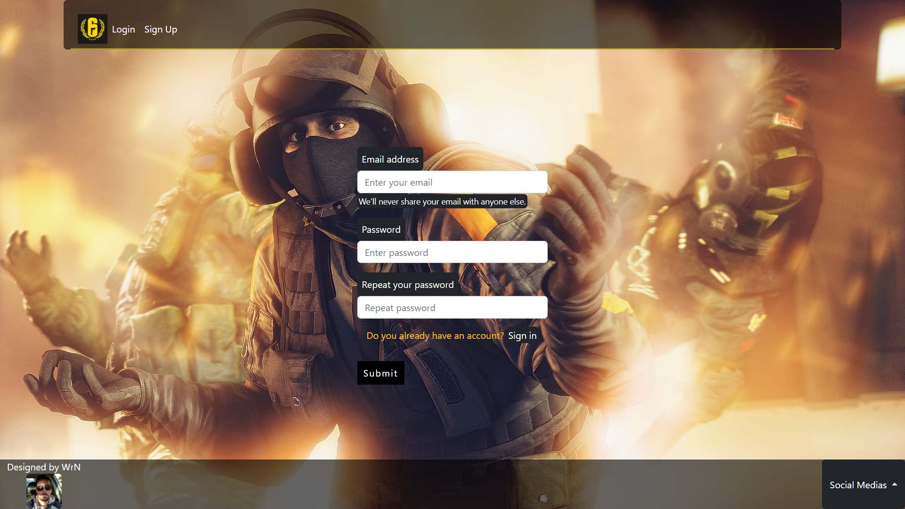
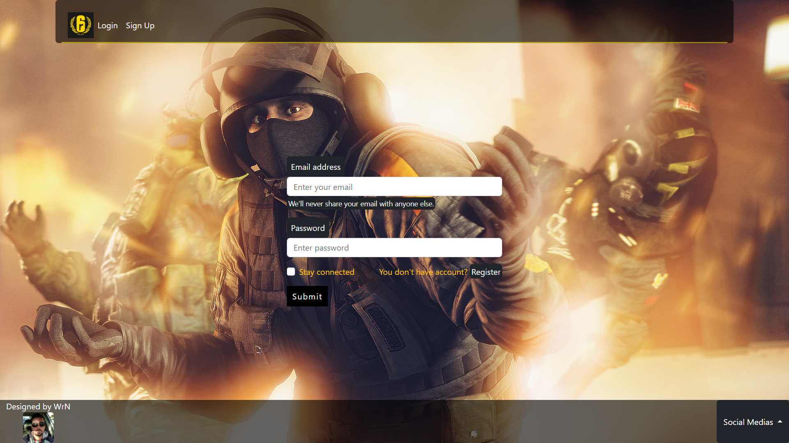

## Project to learn Bootstrap | Sass :computer:

- #### Here, i trying to make improvements in the last repository using the frameworks specs in the title.

  --------------------------------------------------

  ##### In this project, i learned how to use npm and combine Bootstrap with Sass.

  ##### 
How looks the page:

  ##### 
home:

  

##### 
Sign Up:

##### 
Login:

####  Deploy - [https://wrn-gameplay-page.netlify.app](https://wrn-gameplay-page.netlify.app/).
